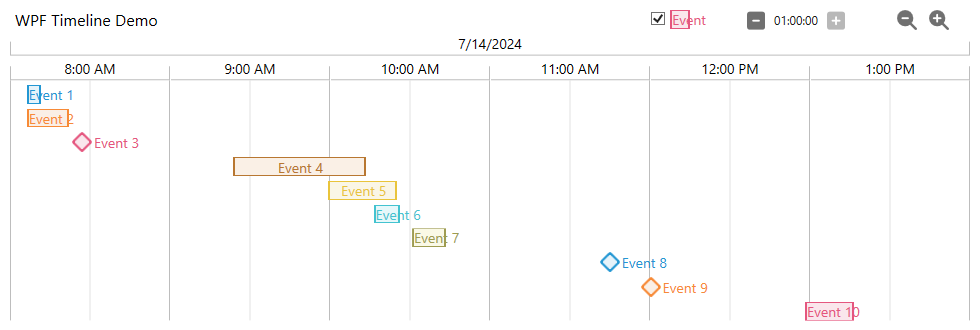

# WPF Timeline Control

A timeline control for WPF, available for personal or commercial use under the [MIT license](LICENSE).

## Using the control

1. Install the NuGet package or download the source add add it to your Solution.
1. In your Window or UserControl, add the XAML namespace:

        xmlns:tim="clr-namespace:WpfTimelineControl;assembly=WpfTimelineControl"

1. Add the Timeline control:

       <Grid>
           <tim:Timeline x:Name="myTimeline" />
       </Grid>

1. Through a Data Binding or code-behind, set the Timeline's DataContext:

       List<TimelineEntry> entries = new List<TimelineEntry>
       {
           new TimelineBar("Event 1", DateTime.Now, TimeSpan.FromSeconds(92), 0),
           new TimelinePoint("Event 2", DateTime.Now, TimeSpan.FromSeconds(17), 1),
       };

       var timelineBuilder = TimelineBuilderFactory.Create();

       var viewModel = timelineBuilder.BuildViewModel(entries.ToArray());

       myTimeline.DataContext = viewModel;

## Customisation
See the [Demo Apps](/DemoApps) for a demonstration of all the customisation options.

### Dependency Properties

- To customise the colours of the timeline entries, set `TimelineEntryBrushes`:

      <tim:Timeline TimelineEntryBrushes="{StaticResource TimelineItemColors}" />

      <Application.Resources>
          <SolidColorBrush x:Key="CorporateColor" Color="#2397D3" />
          <x:Array Type="SolidColorBrush" x:Key="TimelineItemColors">
              <SolidColorBrush Color="{Binding Color,Source={StaticResource CorporateColor1}}" />
              <SolidColorBrush Color="#E9C43B" />
          </x:Array>
      </Application.Resources>

  Type: `Brush[]` Default: `{ Brushes.Red, Brushes.Green, Brushes.Blue, Brushes.Yellow, Brushes.Magenta }`

- To change the colour used for the 'Labels exceed bars' setting, set `LabelsExceedBarsSettingColorIndex`:

      <tim:Timeline LabelsExceedBarsSettingColorIndex="2" />

  Type: `int` Default: `0`

- To choose whether the events' name labels are coloured, set `ColoredEntryNameLabels`:

      <tim:Timeline ColoredEntryNameLabels="True" />

  Type: `Boolean` Default: `True`

- The 3 strings used in the control can be translated using `NameLabel`, `StartLabel` and `EndLabel`

      <tim:Timeline NameLabel="{lex:Loc Key=LBL_Name}"
                    StartLabel="{lex:Loc Key=LBL_Start}"
                    EndLabel="{lex:Loc Key=LBL_End}" />

  Type: `string` Default: `"Name"`, `"Start"`, `"End"`

- With the top bar hidden, you can fix the `LabelsExceedBars` setting:

      <tim:Timeline LabelsExceedBars="False" />

  Type: `Boolean` Default: `True`

### ViewModel Properties

- Add a title to the timeline by setting `Title`:

      viewModel.Title = "Events Today"

  Type: `string` Default: `NULL`

- Hide the settings controls on the top bar by setting `ShowControls`:

      viewModel.ShowControls = false

  Type: `Boolean` Default: `true`

- Hide the longer date interval markers by setting `ShowDateMarkers`:

      viewModel.ShowDateMarkers = false

  Type: `Boolean` Default: `true`

- With the top bar hidden, you can fix the `PixelsPerInterval` setting, which affects the width of each interval and therefore of the timeline control:

      viewModel.PixelsPerInterval = 160;
  
  Type: `int` Default: `320`

- With the top bar hidden, you can fix the `MajorIntervalSeconds` setting, which sets the timescale represented by each interval:

      viewModel.MajorIntervalSeconds = TimelineConstants.IntervalOptions[3];
  
  Type: `int` Default: `[calculated based on the events]`

### Static Variables

The **`TimelineConstants`** class contains two static variables that control the behaviour of the timeline control.

The `TimelineBuilder` uses these values, which I have set based on my experience using this control at my previous company, but you may need to tweak them based on your data.

The timeline is always linear; each interval represents the same amount of time. The builder chooses one of the values from the **`IntervalOptions`** array, from 10 seconds up to 60 minutes.

The builder calculates the total duration of the events (from the beggining of the first to the end of the last) then divides this by the **`TimelineScalingFactor`** and finds the closest value from the options array.
